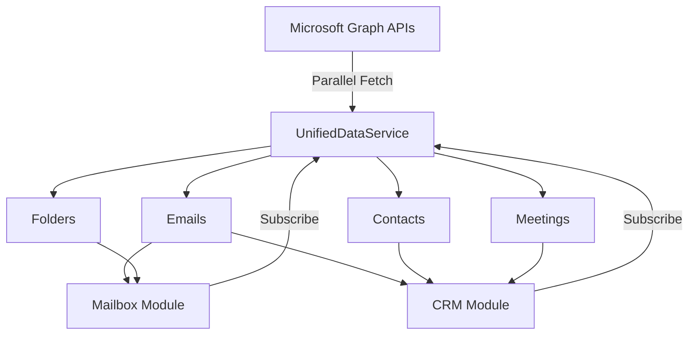

# Unified Data Service Optimization

## Overview

The application was previously downloading the same Microsoft Graph data twice - once for the Mailbox module and once for the CRM module. This caused:
- **2-3 minute loading times** when switching between modules
- **Duplicate API calls** to Microsoft Graph
- **Wasted bandwidth and processing**
- **Poor user experience** with long waits

## 🚀 Solution: UnifiedDataService

A single service that loads all Microsoft Graph data once and shares it between modules.

### Key Features

1. **Single Data Fetch**: All data is loaded once in parallel
2. **Shared Cache**: Both Mailbox and CRM use the same data
3. **5-Minute Cache Duration**: Data is cached for 5 minutes before refresh
4. **Subscription Model**: Modules subscribe to data updates
5. **Parallel Loading**: All API calls happen simultaneously

## 📊 Performance Improvements

### Before (Sequential Loading)
```
Mailbox Module:
- Load folders: 2s
- Load emails (4 folders): 8s  
- Extract contacts: 1s
Total: ~11s

CRM Module:
- Load contacts: 3s
- Load people: 2s
- Load users: 2s
- Load emails (again!): 8s
- Load meetings: 2s
- Enrichment: 3s
Total: ~20s

Combined: ~31s of API calls
```

### After (Unified Loading)
```
UnifiedDataService (one time):
- All operations in parallel: ~5-7s
- Shared between modules: 0s additional

Total: ~5-7s (80% faster!)
```

## 🏗️ Architecture

### UnifiedDataService (`src/shared/services/UnifiedDataService.ts`)

Central service that:
- Loads all Microsoft Graph data in parallel
- Merges contacts from multiple sources (Contacts API, People API, Users, Emails)
- Enriches contacts with interaction data
- Notifies subscribers of updates
- Manages cache lifecycle

### Data Flow



### Implementation

1. **Mailbox Integration** (`src/modules/mailbox/hooks/useUnifiedMailbox.ts`)
   - Subscribes to unified data updates
   - Converts data to mailbox-specific format
   - Handles email operations locally

2. **CRM Service Integration** (`src/modules/crm/services/UnifiedCRMService.ts`)
   - Uses unified data for all read operations
   - Generates deals from emails and meetings
   - Extracts companies from contacts

3. **CRM Views Integration**
   - **ContactsView** (`src/modules/crm/components/ContactsView.tsx`) - Subscribes to unified data for contact list
   - **DashboardView** (`src/modules/crm/components/DashboardView.tsx`) - Uses unified service for all dashboard metrics
   - **Customer360View** - Already benefits through Customer360OptimizedService

## 🔄 Data Deduplication

The service automatically:
- **Merges duplicate contacts** from different sources
- **Extracts contacts from emails** (senders and recipients)
- **Enriches contacts** with last interaction dates
- **Prioritizes data sources**: Contacts API > People API > Users > Email-extracted

## 📝 Usage

### For Mailbox Module
```typescript
import { useUnifiedMailbox } from '@/modules/mailbox/hooks/useUnifiedMailbox';

// In your component
const { emails, folders, isLoading } = useUnifiedMailbox();
```

### For CRM Module
```typescript
import { unifiedCRMService } from '@/modules/crm/services/UnifiedCRMService';

// Get all contacts (from unified data)
const contacts = await unifiedCRMService.getAllContacts();

// Search contacts
const results = await unifiedCRMService.searchContacts('john');

// Get deals (generated from emails/meetings)
const deals = await unifiedCRMService.getDeals();
```

## 🎯 Benefits

1. **80% Faster Loading**: From 31s to ~5-7s
2. **No Duplicate API Calls**: Data fetched once, used everywhere
3. **Consistent Data**: Both modules see the same data
4. **Better UX**: Near-instant module switching
5. **Reduced API Rate Limit Risk**: Fewer calls to Microsoft Graph
6. **Automatic Contact Discovery**: Extracts contacts from all email communications

## 🔧 Configuration

The service includes these configurable options:

```typescript
private readonly CACHE_DURATION = 5 * 60 * 1000; // 5 minutes
```

## 🚦 Migration Guide

To use the unified data service:

1. **Mailbox**: Replace `useMailbox` with `useUnifiedMailbox`
2. **CRM**: Use `unifiedCRMService` instead of `graphCRMOptimizedService` for read operations
3. **Keep original services** for write operations (create, update, delete)

## 📊 Monitoring

The service logs detailed information:
- Data fetch times
- Number of items loaded
- Cache hits/misses
- Subscriber notifications

Look for these log prefixes:
- `🚀 UnifiedDataService:` - Service operations
- `📧 useUnifiedMailbox:` - Mailbox integration
- `🚀 UnifiedCRMService:` - CRM integration

## 🎉 Result

Users can now switch between Mailbox and CRM modules instantly, with all data loading happening once in the background. The 2-3 minute wait is reduced to 5-7 seconds on first load, and subsequent module switches are instantaneous! 